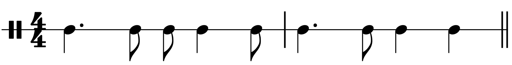

Jazz Listening: Cool 6

1. TOC
{:toc}
{: .toc}

## Cecil Payne: 'Saucer Eyes'

This was released in 1957.

<iframe width="560" height="315" src="https://www.youtube.com/embed/Yu33E5DHKe8?start=0&end=205" title="YouTube video player" frameborder="0" allow="accelerometer; autoplay; clipboard-write; encrypted-media; gyroscope; picture-in-picture" allowfullscreen></iframe>

1. Complete the table to show the instrumentation.

	<table>
	<tr>
		<th>Front line</th><td>
Baritone sax, trumpet
</td>
	</tr>
	<tr>
		<th>Rhythm section</th><td>
Piano, bass, drums
</td>
	</tr>
	</table>

2. Describe the structure of each chorus using letters.
	
	
AABA (where the final A is slightly lengthened)
	
2. Complete the table to show the structure from 0:00 to 3:25.
	
	<table>
		<tr>
			<th>&nbsp;</th>
			<th>Section 1</th>
			<th>Section 2</th>
			<th>Section 3</th>
			<th>Section 4</th>
			<th>Section 4</th>
		</tr>
		
		<tr>
			<th>Time</th>
			<td>0:00</td>
			<td>
0:12
</td>
			<td>
1:00
</td>
			<td>
1:48
</td>
			<td>
2:36
</td>
		</tr>
		
		<tr>
			<th>Number of bars</th>
			<td>8</td>
			<td>
36
</td>
			<td>
36
</td>
			<td>
36
</td>
			<td>
36
</td>
		</tr>
		
		<tr>
			<th>Details/summary</th>
			<td>Intro</td>
			<td>
Head
</td>
			<td>
Baritone sax solo
</td>
			<td>
Baritone sax solo (2nd chorus)
</td>
			<td>
Trumpet solo
</td>
		</tr>
	</table>
	
3. Describe the music played by the front line in the introduction

	

		<ul>
			<li>Starts on beat 2.5</li>
			<li>Anacrusis</li>
			<li>Uses a narrow range of notes</li>
			<li>Mostly uses the third, fourth and fifth scale degrees</li>
			<li>Unison/in octaves</li>
			<li>Cross-rhythm at the end of the introduction</li>
		</ul>
	

3. Name the most common interval between the two front line instruments during the head (0:12–0:32).
	
4. Name the other interval between the two front line instruments at the end of the A section in the head.

	
(Compound) third, tenth

	
5. Name the scale used during the A section in the head (0:12–0:32).

	
Major scale

	

## Freddie Hubbard: 'Little Sunflower'

<iframe width="560" height="315" src="https://www.youtube.com/embed/OtB8dEuEmNM?start=00&end=" title="YouTube video player" frameborder="0" allow="accelerometer; autoplay; clipboard-write; encrypted-media; gyroscope; picture-in-picture" allowfullscreen></iframe>

1967 is a little late for Eduqas, but this standard is still a good listen, with elements of cool jazz and the 1960s bossa nova craze.

1. The tempo is around 140 BPM. How many bars long is the introduction?

	
16 bars.

	
2. The head contains a number of 8-bar sections. How many are there, and so how many bars long is the head overall?

	
5 x 8-bar sections = 40 bars.

	
2. Define the structure of the head section using letter names.

	
AABAA. Note the repeated A section at the end of the form that makes it 40 and not 32 bars.

	
2. The bass plays a repeating two-bar rhythm throughout. Dictate this rhythm.

	

	
4. Name the two front-line instruments.
	

		<ul>
			<li>Trumpet></li>
			<li>Flute</li>
		</ul>
	

	
1. Name the interval between these two instruments in the majority of the head.

	
Third

	
1. Which instrument plays the higher note?

	
Trumpet

	
1. Describe how the relationship between the instruments changes in the middle of the head (0:56)
	
	
Trumpet plays the melody. Flute improvises fast answering phrases/interjections between trumpet phrases.

	
3. Describe the use of harmony in the introduction and head.

	

		<ul>
			<li>Modal. Dorian mode (in Introduction and A sections).</li>
			<li>Static harmony; very slow harmonic rhythm.</li>
			<li>Bass defines the harmony by playing tonic and dominant notes throughout.</li>
			<li>Piece only uses tonic and flattened supertonic chords.</li>
			<li>A sections in the head use minor tonic chords; B setions use major tonic chords.</li>
			<li>Extended chords in piano. Some passing chromatic chords in piano, particularly at the end of sections.</li>
		</ul>
	

### Harmony

The chords below are found in 'Little Sunflower'. Complete the table.

<table>
	<tr>
		<th>Chord</th><th>Notes</th>
	</tr>
	
	<tr>
		<td>DMaj7</td><td>
D, F#, A, C#
</td>
	</tr>

	<tr>
		<td>EbMaj7</td><td>
Eb, G, Bb, D
</td>
	</tr>
	
	
	<tr>
		<td>
Dm7
</td><td>D, F, A, C</td>
	</tr>
	
</table>